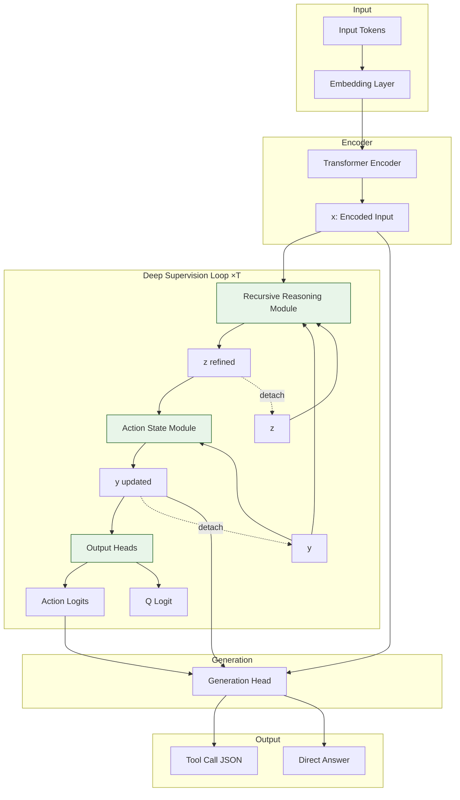

# TRM-LLM Architecture



## Data Flow

```
Input → Encoder → [Reasoning(x,y,z) → Action(y,z)]×T → Output Heads → Generation
```

## Components

| Module | Function |
|--------|----------|
| **Encoder** | Transforms input tokens to hidden states x |
| **Reasoning Module** | Recursively refines z = f(x, y, z) for n iterations |
| **Action Module** | Updates action state y = g(y, z) |
| **Output Heads** | Predicts action type, num calls, Q (correctness prediction) |
| **Generation Head** | Generates tool call JSON or direct answer text |
